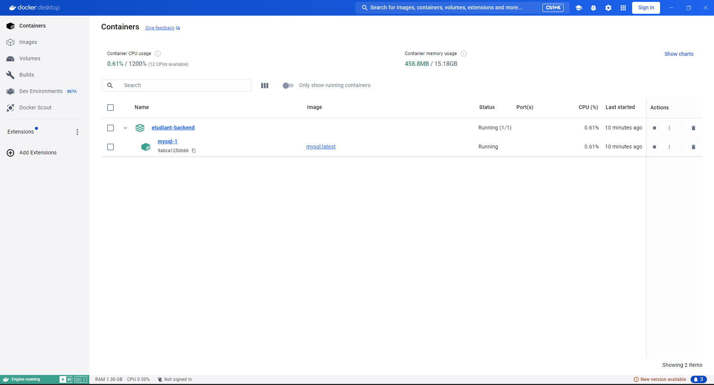

# DataShare backend

Backend de base pour un site de partage de fichiers avec authentification JWT et PostgreSQL.

## Configuration du backend

Les paramètres de démarrage sont centralisés dans `.env` :

- `SERVER_PORT=8443`
- `SERVER_SSL_ENABLED=true`
- `SERVER_SSL_KEY_STORE=ssl\\datashare-dev.p12`
- `SERVER_SSL_KEY_STORE_PASSWORD=changeit`
- `SERVER_SSL_KEY_STORE_TYPE=PKCS12`
- `SERVER_SSL_KEY_ALIAS=datashare-dev`
- `COOKIE_SECURE=true`

## Pré-requis pour le bon fonctionnement du service :

    -> JDK 26
    -> Docker
    -> Docker Compose
    -> Maven 3.9.3 (https://archive.apache.org/dist/maven/maven-3/3.9.3/binaries/) ou plus

## Démarrage du backend
Pour démarrer le projet backend, il faut : 
- avoir démarré Docker-Desktop sur votre poste de travail local.
- dans une console, se placer à la racine du projet et exécuter le script suivant :
```
run-java26.bat
```

    Cette commande va : 
     - lire les variables de `.env`
     - générer le keystore local s'il n'existe pas encore
     - lancer le serveur du backend en HTTPS sur `https://localhost:8443`
     - connecter le backend à la base de données PostgreSQL

Les traces logs devraient ressemblées à ceci : 
```
.   ____          _            __ _ _
/\\ / ___'_ __ _ _(_)_ __  __ _ \ \ \ \
( ( )\___ | '_ | '_| | '_ \/ _` | \ \ \ \
\\/  ___)| |_)| | | | | || (_| |  ) ) ) )
'  |____| .__|_| |_|_| |_\__, | / / / /
=========|_|==============|___/=/_/_/_/

:: Spring Boot ::                (v3.5.5)

[DataShare] [           main] c.o.datashare.DataShareApplication  : Starting DataShareApplication using Java 21.0.3 with PID 6964
[DataShare] [           main] c.o.datashare.DataShareApplication  : No active profile set, falling back to 1 default profile: "default"
[DataShare] [           main] .s.b.d.c.l.DockerComposeLifecycleManager : Using Docker Compose file ******DataShare\compose.yaml*****
[DataShare] [utReader-stderr] o.s.boot.docker.compose.core.DockerCli   :  Container datashare-postgres-1  Created
[DataShare] [utReader-stderr] o.s.boot.docker.compose.core.DockerCli   :  Container datashare-postgres-1  Starting
[DataShare] [utReader-stderr] o.s.boot.docker.compose.core.DockerCli   :  Container datashare-postgres-1  Started
[DataShare] [utReader-stderr] o.s.boot.docker.compose.core.DockerCli   :  Container datashare-postgres-1  Waiting
[DataShare] [utReader-stderr] o.s.boot.docker.compose.core.DockerCli   :  Container datashare-postgres-1  Healthy
[etudiant-backend] [           main] .s.d.r.c.RepositoryConfigurationDelegate : Bootstrapping Spring Data JPA repositories in DEFAULT mode.
[etudiant-backend] [           main] .s.d.r.c.RepositoryConfigurationDelegate : Finished Spring Data repository scanning in 39 ms. Found 1 JPA repository interface.
[etudiant-backend] [           main] o.s.b.w.embedded.tomcat.TomcatWebServer  : Tomcat initialized with port 8080 (http)
[etudiant-backend] [           main] o.apache.catalina.core.StandardService   : Starting service [Tomcat]
[etudiant-backend] [           main] o.apache.catalina.core.StandardEngine    : Starting Servlet engine: [Apache Tomcat/10.1.44]
[etudiant-backend] [           main] o.a.c.c.C.[Tomcat].[localhost].[/]       : Initializing Spring embedded WebApplicationContext
[etudiant-backend] [           main] w.s.c.ServletWebServerApplicationContext : Root WebApplicationContext: initialization completed in 1354 ms
[etudiant-backend] [           main] o.hibernate.jpa.internal.util.LogHelper  : HHH000204: Processing PersistenceUnitInfo [name: default]
[etudiant-backend] [           main] org.hibernate.Version                    : HHH000412: Hibernate ORM core version 6.6.26.Final
[etudiant-backend] [           main] o.h.c.internal.RegionFactoryInitiator    : HHH000026: Second-level cache disabled
[etudiant-backend] [           main] o.s.o.j.p.SpringPersistenceUnitInfo      : No LoadTimeWeaver setup: ignoring JPA class transformer
[etudiant-backend] [           main] com.zaxxer.hikari.HikariDataSource       : HikariPool-1 - Starting...
[etudiant-backend] [           main] com.zaxxer.hikari.pool.HikariPool        : HikariPool-1 - Added connection com.mysql.cj.jdbc.ConnectionImpl@4db16677
[etudiant-backend] [           main] com.zaxxer.hikari.HikariDataSource       : HikariPool-1 - Start completed.
[etudiant-backend] [           main] org.hibernate.orm.connections.pooling    : HHH10001005: Database info:
[etudiant-backend] [           main] o.h.e.t.j.p.i.JtaPlatformInitiator       : HHH000489: No JTA platform available (set 'hibernate.transaction.jta.platform' to enable JTA platform integration)
[etudiant-backend] [           main] j.LocalContainerEntityManagerFactoryBean : Initialized JPA EntityManagerFactory for persistence unit 'default'
[etudiant-backend] [           main] JpaBaseConfiguration$JpaWebConfiguration : spring.jpa.open-in-view is enabled by default. Therefore, database queries may be performed during view rendering. Explicitly configure spring.jpa.open-in-view to disable this warning
[etudiant-backend] [           main] o.s.b.a.e.web.EndpointLinksResolver      : Exposing 1 endpoint beneath base path '/actuator'
[etudiant-backend] [           main] eAuthenticationProviderManagerConfigurer : Global AuthenticationManager configured with AuthenticationProvider bean with name authenticationProvider
[etudiant-backend] [           main] r$InitializeUserDetailsManagerConfigurer : Global AuthenticationManager configured with an AuthenticationProvider bean. UserDetailsService beans w
ill not be used by Spring Security for automatically configuring username/password login. Consider removing the AuthenticationProvider bean. Alternatively, consider using the UserDetailsService in a manually instantiated DaoAuth
enticationProvider. If the current configuration is intentional, to turn off this warning, increase the logging level of 'org.springframework.security.config.annotation.authentication.configuration.InitializeUserDetailsBeanManagerConfigurer' to ERROR
[etudiant-backend] [           main] o.s.b.w.embedded.tomcat.TomcatWebServer  : Tomcat started on port 8080 (http) with context path '/'
[etudiant-backend] [           main] c.o.etudiant.EtudiantBackendApplication  : Started EtudiantBackendApplication in 10.27 seconds (process running for 10.642)
```

Sur Docker-Desktop, vous devriez voir apparaître un container MySQL qui correspond au projet.



    Vous pouvez vous connecter à la base de données et vérifier que la table ```users``` a été créée automatiquement.
Pour cela, cliquez sur le lien `mysql-1` ce qui vous amènera sur la vue complète de la base de données. 
Dans l'onglet ```Exec```, il faut : 

1. se connecter à la base de données. Tapez la commande ci-dessous

    ```
    psql -U etudiant_db -d etudiant_db
    ```
   L'invite de commande demandera le mot de passe. Il est identique au nom d'utilisateur, c'est-à-dire ```etudiant_db```.


2. Se connecter au schéma de base de données `etudiant_db`. Dans l'invite de commande, tapez la commande ci-dessous :

    ```
    \c etudiant_db
    ```
  
3. Vérifier que la table `user` existe (elle est néanmoins vide pour le moment).

    ```
    select * from users;
    ```
    Le résultat devrait être : `Empty set (0.00 sec)`

La capture d'écran ci-dessous résume les étapes précédentes : 


## Exécution des tests
Pour exécuter les tests Junit, il faut :
- avoir démarré Docker-Desktop sur votre poste de travail local. Cette étape est nécessaire car les tests d'intégration auront besoin de Docker pour créer des bases de données temporaires de test.
- dans une console, se placer à la racine du projet et exécuter la commande Maven suivante :

```
mvn clean test
```

## Fonctionnalités portées

    - API d'inscription
    - API de connexion JWT
    - Base prête pour les futures APIs de partage de fichiers


## Écrans ou blocs concernés
    - Ecran xxx
    - Ecran xxx
    - Ecran xxx


